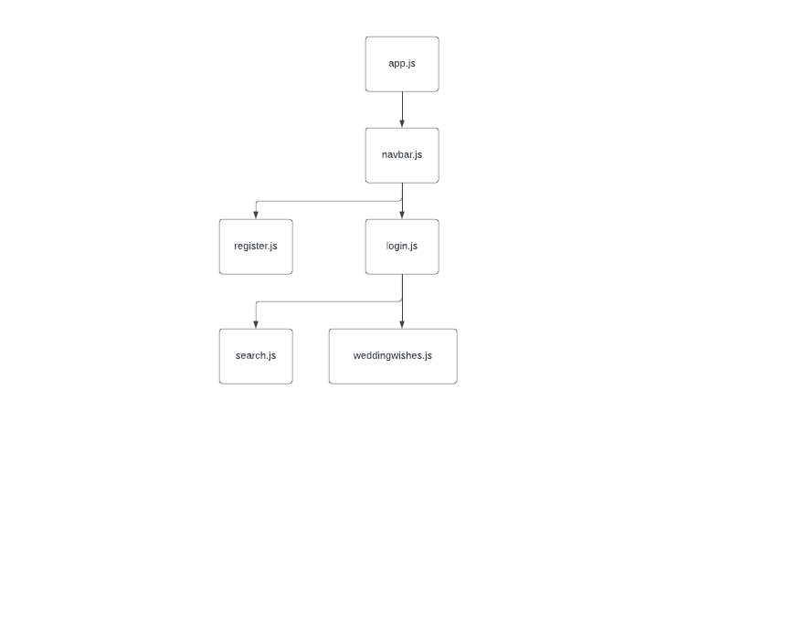
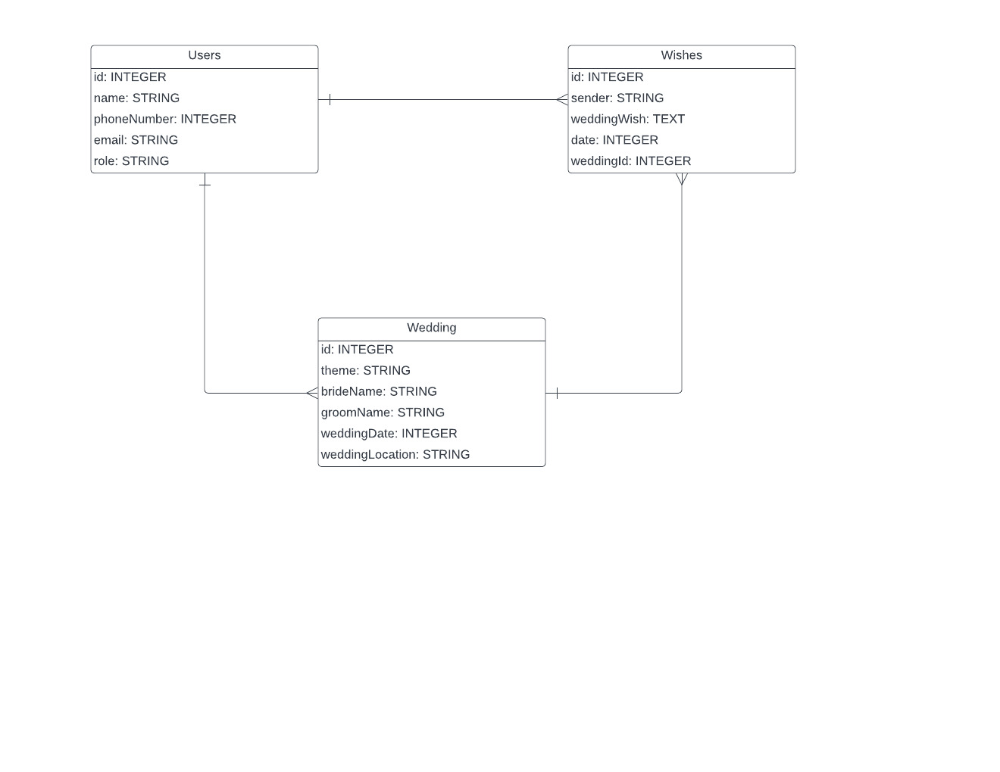

# Wedding-wish

# Date: 9/2/2022

## By: Seng Kit Mun / Cedric Mun

## **_Links_**

## Link to Wedding-wish: [Wedding-wish]()

[Trello Progress](https://trello.com/b/P3i7TqwR/wedding-wish) | [GitHub](https://github.com/Aonmonomer) | [LinkedIn](https://www.linkedin.com/in/cedricmun/)

---

## **_Description_**

### # Wedding-wish is a website that allows the couple to register themselves and create a whiteboard for the guest to create, read, update and delete their best wishes! 

---

## **_Technologies_**

- ## CSS
- ## JavaScript
- ## React
- ## Django

---

## **_HR-Management-Systems Screenshots_**

---

## **_Credits_**

## Project progression: [trello.com](https://trello.com/b/63icoQUY/hr-management-systems)

## Project guide: [github.com](https://github.com/Aonmonomer/HR-Management-Systems)

## HTML and CSS guide: [w3schools.com](https://www.w3schools.com/)

## Drawing ERD and component diagram: [lucidchart.com](https://www.lucidchart.com)

## Image hosting: [imgbb.com](https://imgbb.com/)

## Website deployment: [heroku.com](https://dashboard.heroku.com)

## Image resources: [google.com](https://www.google.com/)
